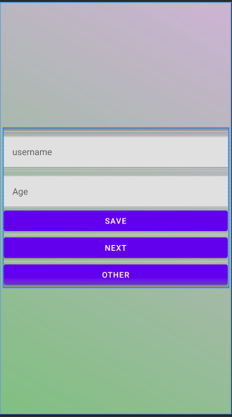
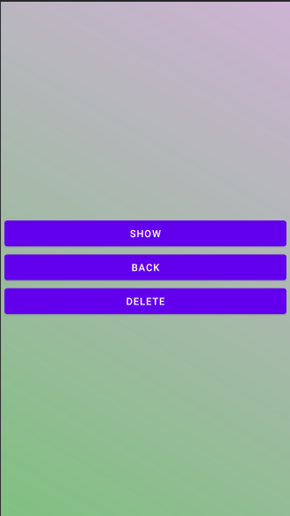
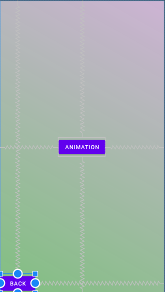

# Simple_Android_app - Project+
This application is build with Java programming language. 

## Table of Contents
* [Introduction](#introduction)
* [Functions](#functions)
* [Virtualization](#virtualization)
* [Installation](#installation)
* [More](#more)
## Introduction
Project+ is a simple android application where we can save our username and age, and than we can see them with the Show Button, you can also see some animation, just click Other button and than click Animation button and the button itself will rotate. We can also delete all of our data with delete button.
## Functions
This project has these functions:
* Save Data
* Show Data
* Delete Data
* Animation
## Virtualization
* Save data: In this page we can write our username and age and we can save with save button.

* Show and Delete data: With Show button we can show our saved data and we can delete all of our data with the delete button.

  

* Animation: If we click the animation button the buttom itself will rotate.

  

## Installation

This application must be cloned or downloaded and then connected to a physical connection between a PC and an Android phone that can be installed on the phone, or can even be simulated virtually by Android Studio.

## More
* This project was created as a project for the evaluation of students who have worked on this project in the field of Mobile Devices within the Department of Computer Engineering (in FIEK) at the University of Prishtina (Hasan Prishtina).
 This is version 1.0 of this app.
* Developer:
 Elvir Misini:  https://github.com/elvirmisini
  https://www.linkedin.com/in/elvir-misini-479547202/
